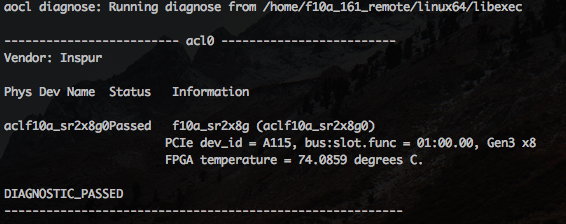

# Installation

##OpenCL SDK Version

Intel® SDK for OpenCL™ 16.1.  

## BSP installation

1. Inspur F10A BSP download

Please contact Inspur agent to get the BSP installation package.

2. Installation steps:

After install Intel® SDK for OpenCL™ 16.1, install BSP as following steps:

 ```shell
yum install gcc gcc-c++
chmod -R 777 /<yourpath>/f10a_161_remote/
source /<yourpath>/fpga_env_161.sh
cd $AOC_BOARD_PACKAGE_ROOT
cd source
make clean
make
source /<yourpath>/fpga_env_161.sh
aocl install
 ```

Check installation result use

```shell
aocl diagnose
```

If you get below result, congratulations for the successul installation.



## Compiling

### Evaluation mode

```shell
aoc -march=emulator src/cnn.cl -v
```

### FPGA running mode

```shell
aoc src/cnn.cl -v
```

## Run

### Evaluation mode

After compiling,  use following command to run in evaluation mode

```shell
#CL_CONTEXT_EMULATOR_DEVICE_ALTERA=1 ./bin/host ../host/model/<your_model_file_path> ../host/model/<your_quantization_file_path> ../host/test_images/<your_test_file_path>
```
for example:

```shell
#CL_CONTEXT_EMULATOR_DEVICE_ALTERA=1 ./bin/host ../host/model/googlenet/param.bin ../host/model/googlenet_Q ../host/test_images/googlenet_data_label_391.bin 1
```

### Actual FPGA running mode

The precompiled rpd files are stored in ./cnn/device/rpd/. 
Please make sure .rpd file has been programed sucessfully with following command, before running program in FPGA.

```
remote_update aclf10a_sr2x8g0 -l f
flash_pcie aclf10a_sr2x8g0 <your_rpd_filename.rpd>
remote_update aclf10a_sr2x8g0 -l 
```

Then execute command to run your program

```shell
./bin/host ../host/model/<your_model_file_path> ../host/model/<your_quantization_file_path> ../host/test_images/<your_test_file_path>
```
for example:

```shell
./bin/host ../host/model/googlenet/param.bin ../host/model/googlenet_Q ../host/test_images/googlenet_data_label_391.bin 1
```

# Trained Model

GoogLeNet, ResNet50 and ResNet50_pruned models are trained and uploaded. Please refer to /cnn/host/models/README for details.

